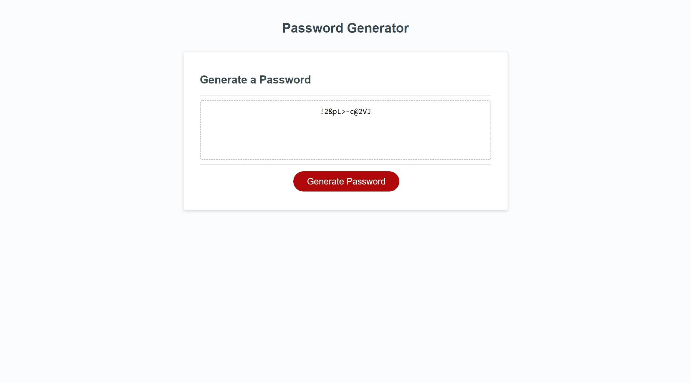

#  Password Generator

## Table of contents
1. [Description](#description)
2. [Installation](#installation)
3. [Usage](#usage)
4. [Credits](#credits)
5. [Questions](#questions)

<h2 id="description"> Project Description </h2>
A password generator is a software tool that creates random or customized passwords for users. It helps users create stronger passwords that provide greater security for a given type of access. This specific program produces complex and strong passwords with combinations of numbers, uppercase and lowercase letters, and special characters such as braces, asterisks, slashes, etc.

## Installation 
This javascript application requires the inquirer npm package (command line user interfaces) and the fs module (let us interact with the file system).

## Usage 
The user will be presented with a password generator webpage, once the generate password button is clicked, then a series of prompts for the password criteria will be presented. After all the questions are answered, then the inputs are validated, the password is generated and is displayed to the page.

## Credits 
the colaborator is evelyn

## Questions 
If you have any questions, please contact me to the information listed below.

*Email: evelyn.gmaldonado@gmail.com
*GitHub: [EvelynGMaldonado](https://github.com/EvelynGMaldonado)

## Extra

* The following images show the web application's appearance and functionality:

* Link to the GitHub Repository:
[Password Generator](https://github.com/EvelynGMaldonado/password_generator)

* Url to the deployed app:
[Password Generator](https://evelyngmaldonado.github.io/password_generator/)